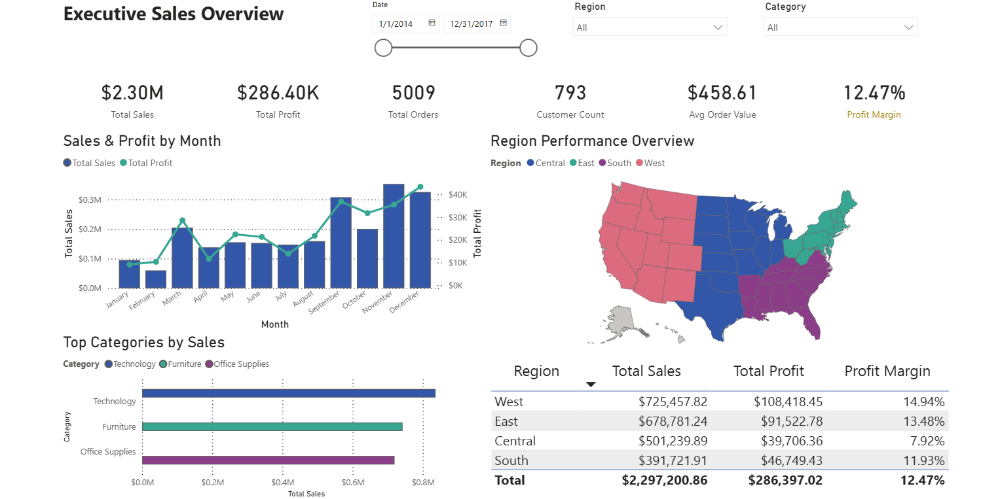
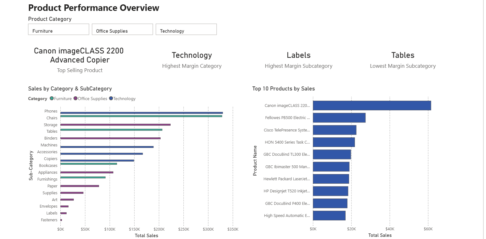
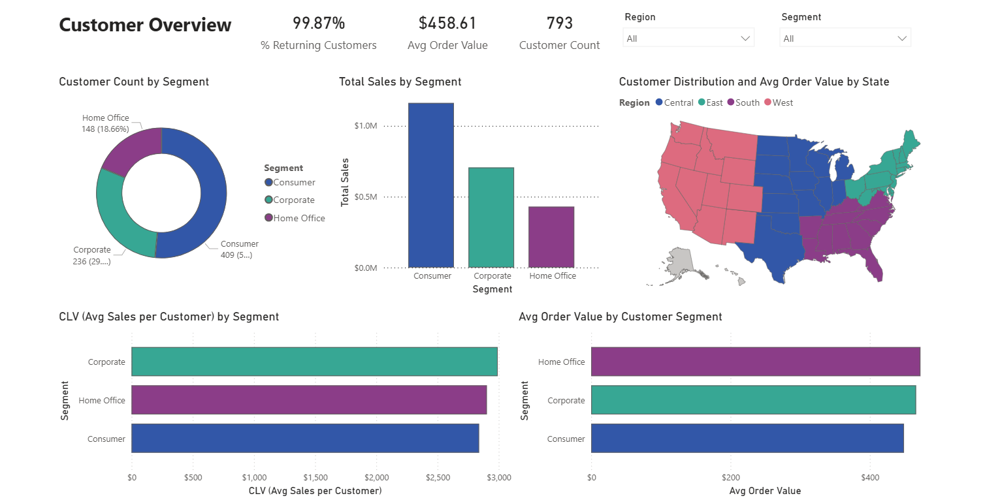

# 📊 Sales & Customer Insights Dashboard (Power BI)

## 🔎 Overview  
This project showcases a **Power BI dashboard** designed to analyze sales performance, product profitability, and customer behavior.  
The goal is to provide actionable insights for executives and stakeholders, enabling data-driven decisions in areas such as **regional sales trends, product category performance, and customer segmentation**.  

---

## 📂 Dataset  
- **Source:** [Superstore Dataset (Kaggle)](https://www.kaggle.com/datasets/vivek468/superstore-dataset-final)  
- The original dataset was provided as a **single flat table** (`superstore.csv`).  
- For professional reporting and scalability, the data was restructured into a **star schema** with proper **dimension and fact tables**.  

---

## 🛠 Data Modeling & Measures  
- Built a **star schema data model** to improve performance and analytical flexibility.  
- Established relationships between:  
  - **Fact Table**: FactSales
  - **Dimension Tables**: DimProducts, DimCustomers, DimRegions, DimDate  
- Developed **10+ DAX measures** for advanced analytics, including:  
  - **Total Sales**, **Total Profit**, **Profit Margin**  
  - **Year-to-Date (YTD)** and **Month-to-Date (MTD)** metrics  
  - **Customer Lifetime Value (CLV)**  
  - **Shipment Status metrics**  

> ⚡ By restructuring the dataset and creating reusable DAX measures, the dashboard provides **faster performance, better scalability, and deeper insights** compared to working with a single flat table.  

---

## 📊 Dashboard Pages  

### 1. Executive Sales Overview  
- High-level KPIs (Sales, Profit, Quantity)  
- Regional sales performance  
- Monthly sales and profit trends  

  

---

### 2. Product Performance Overview  
- Sales & profit by category and subcategory  
- Top 10 best-performing products  
- Profit margin comparison across categories  

  

---

### 3. Customer & Market Overview  
- Customer segmentation and CLV (Customer Lifetime Value)  
- Geographic analysis (city & state-level insights)  
- Shipment analysis  

  

---

## 📈 Key Insights  
- Identified top-performing product categories driving profit.  
- Clear regional differences in sales and profitability.  
- CLV analysis highlights the importance of repeat customers.  
- Shipment trends reveal opportunities for operational improvements.  

---

## 🛠 Tools & Skills Used  
- **Power BI**: Data Modeling, DAX, Power Query, Visualization  
- **Data Cleaning & Transformation**  
- **Business Insights & Dashboard Design**  

---

## 🌍 Live Dashboard  
You can explore the interactive dashboard here:  

[🔗 View Dashboard on Power BI](https://app.powerbi.com/view?r=eyJrIjoiYWE2NjBlNjUtNDUzOS00ZDM3LWIxZmMtMjQyMjE5OTI1YjhiIiwidCI6ImExMzM2ODc5LWFiOWMtNDhiYi1iMWFjLWE2OWNhZTJlOGRmZSIsImMiOjl9)

---

## 🚀 How to Use  
- Download the `.pbix` file from the repository.  
- Open with **Power BI Desktop** to explore interactively.  
 
---

**Ersin Tepegöz**  
Location: Antalya, Turkey  
Email: tepegozersin@gmail.com  
LinkedIn: [linkedin.com/in/tepegozersin](https://www.linkedin.com/in/tepegozersin/)  